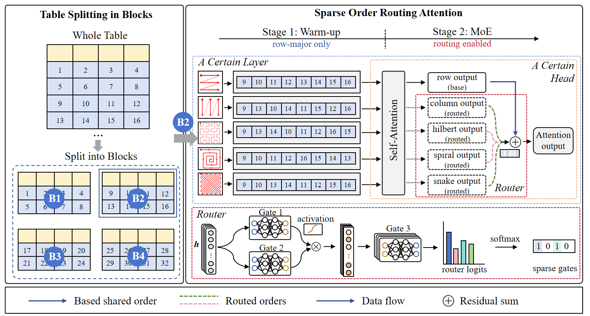

# TableOrder: Rethinking Cell Ordering for Table Understanding in Large Language Models

This repository contains the code for the paper **"TableOrder: Rethinking Cell Ordering for Table Understanding in Large Language Models"**.

## Interactive Visualization Demo

Explore the TableOrder method through our  [interactive visualization website](https://anonymous-tableorder-demo.anonymous-review-assets.workers.dev/).


<p align="center">
  
</p>

---

## 1. Project Structure

After downloading the project, the main directory structure is as follows:

```text
TableOrder/
├── TPE_Llama/                 # Modified LLaMA / MiniCPM model implementation
├── ds_configs/                # DeepSpeed configuration files
│   └── stage2.json
├── eval_scripts/              # Evaluation scripts
│   ├── eval_hitab.py
│   ├── table_utils.py
│   └── metric.py
├── src/                       # Training and inference scripts
│   ├── sft_minicpm_block_textmeta.py
│   ├── run_hitab.sh
│   ├── inference_hitab.sh
│   └── inference.py
└── README.md
```

For HiTab, the main training script is:

```bash
src/run_hitab.sh
```

The main inference script is:

```bash
src/inference_hitab.sh
```

The main evaluation script is:

```bash
eval_scripts/eval_hitab.py
```

---

## 2. Environment Setup

We recommend using Conda to create an isolated environment:

```bash
conda create -n tableorder python=3.10 -y
conda activate tableorder
```

Install the core dependencies:

```bash
pip install torch transformers datasets accelerate peft deepspeed numpy tqdm psutil
```

If you want to enable Flash Attention and your CUDA / PyTorch version supports it, you can additionally install:

```bash
pip install flash-attn --no-build-isolation
```

If Flash Attention installation fails, you can disable it in the training script by changing:

```bash
--use_flash_attn True
```

to:

```bash
--use_flash_attn False
```

---

## 3. Path Configuration

Before running the code, please set the project root path. Suppose the repository is located at:

```bash
/home/your_name/TableOrder
```

You can define the project root in `src/run_hitab.sh` and `src/inference_hitab.sh` as follows:

```bash
PROJECT_ROOT=/home/your_name/TableOrder
cd ${PROJECT_ROOT}/src
export PYTHONPATH=${PROJECT_ROOT}:$PYTHONPATH
```

Then, all data, model, and output paths can be written using `${PROJECT_ROOT}`.

For example:

```bash
${PROJECT_ROOT}/data/hitab_train_7417.json
${PROJECT_ROOT}/eval_data/hitab_test.json
${PROJECT_ROOT}/model/MiniCPM-2B-sft-bf16-llama-format
${PROJECT_ROOT}/output/hitab_adaptive
${PROJECT_ROOT}/res/hitab_adaptive_res.json
```

---

## 4. Model Preparation

The training script uses a MiniCPM-style model checkpoint by default. Please place the base model under the `model/` directory, for example:

```text
TableOrder/
└── model/
    └── MiniCPM-2B-sft-bf16-llama-format/
```

Then set the model path in `src/run_hitab.sh`:

```bash
--model_name_or_path ${PROJECT_ROOT}/model/MiniCPM-2B-sft-bf16-llama-format
```

---

## 5. HiTab Data Preparation

The training script expects the HiTab training file to be placed at:

```bash
${PROJECT_ROOT}/data/hitab_train_7417.json
```

The inference script expects the HiTab test file to be placed at:

```bash
${PROJECT_ROOT}/eval_data/hitab_test.json
```

A recommended data structure is:

```text
TableOrder/
├── data/
│   └── hitab_train_7417.json
└── eval_data/
    └── hitab_test.json
```

Each sample should contain the following fields:

```json
{
  "instruction": "Answer the question based on the given table.",
  "input_seg": "[TAB] col: Year | Revenue | Profit row 1: 2020 | 10 | 2 [SEP] row 2: 2021 | 15 | 3",
  "question": "What is the profit in 2021?",
  "output": "3"
}
```

The code reads the following fields:

```text
instruction
input_seg
question
output
```

The table content is expected to appear in `input_seg`, and the table region should be marked with `[TAB]`.

---

## 6. Training on HiTab

Go to the project directory:

```bash
cd /home/your_name/TableOrder
```

Run the default adaptive-order training script:

```bash
bash src/run_hitab.sh
```

By default, HiTab training enables table blocking:

```bash
ENABLE_TABLE_BLOCKS=True
TABLE_BLOCK_ROWS=6
TABLE_BLOCK_COLS=999
TABLE_HEADER_ROWS=0
TABLE_READ_MODE=adaptive
```

The meaning of these parameters is shown below:

| Parameter | Description |
|---|---|
| `ENABLE_TABLE_BLOCKS` | Whether to split the original table into local table blocks |
| `TABLE_BLOCK_ROWS` | Number of body rows in each table block; the default value for HiTab is 6 |
| `TABLE_BLOCK_COLS` | Number of columns in each table block; 999 usually means no column-wise splitting |
| `TABLE_HEADER_ROWS` | Number of header rows; 0 means automatic detection |
| `TABLE_READ_MODE` | Cell traversal order, including `row`, `column`, `snake`, `hilbert`, `spiral`, `adaptive`, and `2d` |

The training output is saved to:

```bash
${PROJECT_ROOT}/output/hitab_adaptive
```

To train a fixed row-major baseline, run:

```bash
TABLE_READ_MODE=row \
OUTPUT_DIR=${PROJECT_ROOT}/output/hitab_row \
bash src/run_hitab.sh
```

To train a column-major baseline, run:

```bash
TABLE_READ_MODE=column \
OUTPUT_DIR=${PROJECT_ROOT}/output/hitab_column \
bash src/run_hitab.sh
```

To train a Hilbert-order baseline, run:

```bash
TABLE_READ_MODE=hilbert \
OUTPUT_DIR=${PROJECT_ROOT}/output/hitab_hilbert \
bash src/run_hitab.sh
```

To train the adaptive TableOrder model, run:

```bash
TABLE_READ_MODE=adaptive \
OUTPUT_DIR=${PROJECT_ROOT}/output/hitab_adaptive \
bash src/run_hitab.sh
```

---

## 7. Important Training Arguments

Some important training arguments in `src/run_hitab.sh` are:

```bash
--num_train_epochs 2
--per_device_train_batch_size 2
--gradient_accumulation_steps 4
--learning_rate 2e-5
--model_max_length 4096
--bf16 True
--deepspeed ${PROJECT_ROOT}/ds_configs/stage2.json
```

If GPU memory is insufficient, you can reduce memory usage by changing:

```bash
--per_device_train_batch_size 1
--gradient_accumulation_steps 8
--model_max_length 2048
--use_flash_attn False
```

For a quick sanity check, you can train on a small subset by adding:

```bash
--train_sample_size 100
```

---

## 8. Adaptive Order MoE Configuration

When `TABLE_READ_MODE=adaptive`, the code enables order-routing-related parameters:

```bash
USE_ORDER_MOE=True
SHARED_ORDER=row
ROUTED_ORDERS=spiral,hilbert,snake,column
ORDER_TOP_K=3
ORDER_ROUTER_ENTROPY_COEF=0.1
ORDER_ROUTER_TEMPERATURE=0.5
ORDER_AUX_SCALE=0.2
```

The meaning of these parameters is as follows:

| Parameter | Description |
|---|---|
| `SHARED_ORDER=row` | Uses row-major order as the shared default branch |
| `ROUTED_ORDERS` | Candidate traversal orders for Top-K routing |
| `ORDER_TOP_K` | Number of routed orders selected each time |
| `ORDER_ROUTER_ENTROPY_COEF` | Entropy regularization coefficient for the router; a positive value encourages a sharper routing distribution |
| `ORDER_ROUTER_TEMPERATURE` | Softmax temperature for routing; a smaller value makes the distribution sharper |
| `ORDER_AUX_SCALE` | Residual strength of the routed auxiliary branches |

---

## 9. Inference on HiTab

After training, run:

```bash
bash src/inference_hitab.sh
```

The default inference configuration is:

```bash
DATASET_NAME=hitab
ENABLE_TABLE_BLOCKS=True
TABLE_BLOCK_ROWS=6
TABLE_BLOCK_COLS=999
TABLE_HEADER_ROWS=0
TABLE_READ_MODE=adaptive
MODEL_PATH=${PROJECT_ROOT}/output/hitab_adaptive
OUTPUT_PATH=${PROJECT_ROOT}/res/hitab_adaptive_res.json
```

To run inference with a row-major model:

```bash
TABLE_READ_MODE=row \
MODEL_PATH=${PROJECT_ROOT}/output/hitab_row \
OUTPUT_PATH=${PROJECT_ROOT}/res/hitab_row_res.json \
bash src/inference_hitab.sh
```

To run inference with an adaptive TableOrder model:

```bash
TABLE_READ_MODE=adaptive \
MODEL_PATH=${PROJECT_ROOT}/output/hitab_adaptive \
OUTPUT_PATH=${PROJECT_ROOT}/res/hitab_adaptive_res.json \
bash src/inference_hitab.sh
```

The inference result is saved in JSONL format. Each line corresponds to one sample:

```json
{
  "idx": 0,
  "instruction": "...",
  "input_seg": "...",
  "question": "...",
  "output": "gold answer",
  "table_block_mode": true,
  "table_read_mode": "adaptive",
  "table_block_count": 3,
  "predict": "model prediction"
}
```

---

## 10. Small-Scale Inference Check

`src/inference.py` supports randomly sampling a subset of test examples through environment variables.

For a quick inference check, run:

```bash
INFERENCE_SAMPLE_SIZE=100 \
INFERENCE_SAMPLE_SEED=42 \
TABLE_READ_MODE=adaptive \
MODEL_PATH=${PROJECT_ROOT}/output/hitab_adaptive \
OUTPUT_PATH=${PROJECT_ROOT}/res/hitab_adaptive_sample100_res.json \
bash src/inference_hitab.sh
```

---

## 11. Evaluation on HiTab

After inference, go to the evaluation directory:

```bash
cd ${PROJECT_ROOT}/eval_scripts
```

Run:

```bash
python eval_hitab.py --pred_file ../res/hitab_adaptive_res.json
```

The evaluation script reads the following fields from each prediction sample:

```text
predict
output
```

Then it calls `table_utils.evaluate()` to compute the final evaluation metrics.

To evaluate the row-major result:

```bash
python eval_hitab.py --pred_file ../res/hitab_row_res.json
```

To evaluate the adaptive TableOrder result:

```bash
python eval_hitab.py --pred_file ../res/hitab_adaptive_res.json
```

---

## 12. Recommended End-to-End Workflow

```bash
# 1. Go to the project root
cd /home/your_name/TableOrder

# 2. Train the adaptive TableOrder model on HiTab
TABLE_READ_MODE=adaptive \
OUTPUT_DIR=${PROJECT_ROOT}/output/hitab_adaptive \
bash src/run_hitab.sh

# 3. Run inference
TABLE_READ_MODE=adaptive \
MODEL_PATH=${PROJECT_ROOT}/output/hitab_adaptive \
OUTPUT_PATH=${PROJECT_ROOT}/res/hitab_adaptive_res.json \
bash src/inference_hitab.sh

# 4. Evaluate
cd ${PROJECT_ROOT}/eval_scripts
python eval_hitab.py --pred_file ../res/hitab_adaptive_res.json
```

---

